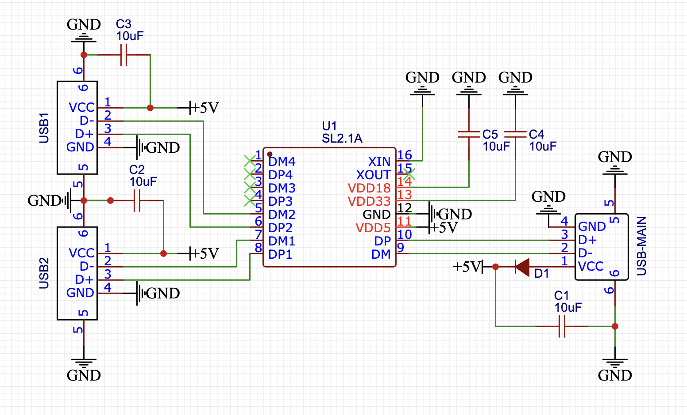
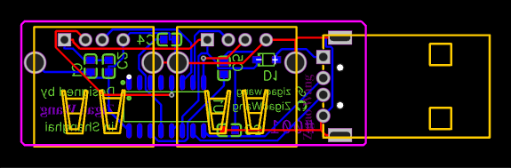
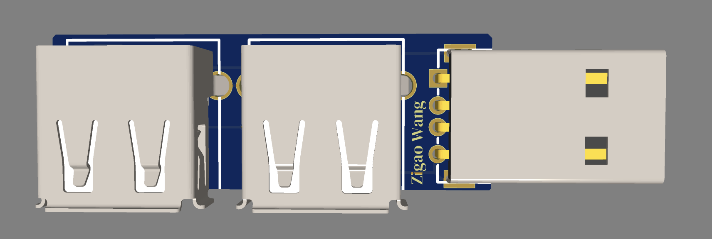
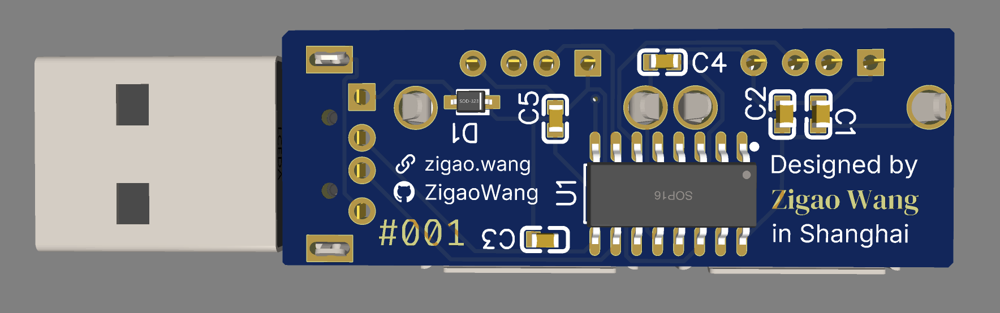
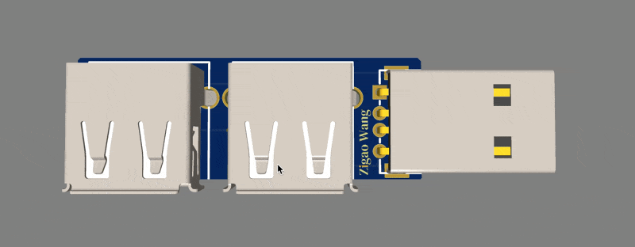

# PCB USB Hub

A **PCB USB Hub** is a custom-built circuit board that splits a single USB connection into multiple USB ports, allowing devices to share a single connection for power and data transfer.

This project was inspired by and created following the tutorial at [Hacker Card Jam](https://jams.hackclub.com/batch/usb-hub). Huge thanks to the Hack Club community for their guidance and support!

## Schematic

## Gerber Files  

## Previews  
### Front and Back Side-by-Side  

  
  

## Animation  

## Components & Specifications

### 1. **CoreChips SL2.1A USB Hub Controller**
   - **Part Number**: C192893
   - **Function**: Main chip to manage USB ports, handles power and data lines for USB-A connectors.
   - **Pinout**:
     - **VDD5**: 5V Power (also called VCC or VBUS)
     - **GND**: Ground
     - **DP**: Data Positive (also called D+)
     - **DM**: Data Negative (also called D-)

### 2. **USB-A Male Connector**  
   - **Part Number**: C98125  
   - **Function**: Input connection for plugging the hub into a computer.

### 3. **USB-A Female Connectors**  
   - **Part Number**: C46407  
   - **Function**: Output ports for connecting devices to the USB hub.
   - **Pins**: 
     - **Pin 1 (VCC)**: Power (5V)
     - **Pin 2 (D-)**: Data Negative
     - **Pin 3 (D+)**: Data Positive
     - **Pin 4 (GND)**: Ground
     - **Pin 5 & 6 (Shield)**: Metal shield ground.

### 4. **Schottky Diode**  
   - **Part Number**: C48192  
   - **Function**: Protects the circuit from reverse voltage and power surges. Positioned after the 5V power input to prevent overvoltage from the laptop.

### 5. **Decoupling Capacitor**  
   - **Part Number**: C19702  
   - **Function**: Protects the circuit by smoothing out power fluctuations. Typically placed after the Schottky diode.
   - **Capacitance**: 10µF

### 6. **Other Components**:
   - **Unused Ports**: Pins for 3rd and 4th USB ports are not used, but should be labeled as "No Connection" in the schematic.
   - **Power Capacitors**: Additional 10µF capacitors for power rails VDD33 and VDD18.
   - **Clock Circuits (XIN and XOUT)**: Not used for this design, so XIN is grounded and XOUT is disconnected.

## Design Process Overview

### 1. **Start a New Project**
   - Create a new project in EasyEDA.

### 2. **Add the Parts**
   - Add USB-A male and female connectors.
   - Add the CoreChips SL2.1A USB controller.
   - Place additional components like the Schottky diode and capacitors.

### 3. **Connect the Components**
   - Connect the USB-A male to the CoreChips SL2.1A controller’s VCC, GND, DP, and DM pins.
   - Connect the female USB-A connectors to the DP and DM pins of the main controller.
   - Add the Schottky diode and decoupling capacitors to protect against power surges and fluctuations.

### 4. **Nets for Clean Wiring**
   - Use nets to organize connections, especially for GND and power lines. This makes the schematic easier to read.

### 5. **Power Surge Protection**
   - Place the Schottky diode and decoupling capacitors to protect the hub and connected devices from power surges.

### 6. **Unused Ports**
   - For unused USB ports (3rd and 4th), mark them as "No Connection" in the schematic.

### 7. **Final Checks**
   - Ensure all pins are connected and there are no unconnected nets before generating the PCB layout.

### 8. **Generate PCB Layout**
   - Once the schematic is complete, move to the PCB layout to position the components and route the traces.

### 9. **Testing and Prototyping**
   - Build and test the PCB to ensure it works as expected before finalizing the design.
